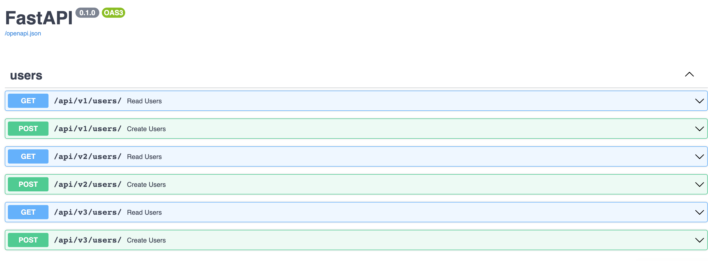

# microservice

# About the Project
Example microservice application built in Python.

## Built With
* Python
* FastAPI: ASGI-compliant web framework 
* Uvicorn: ASGI server
* Pydantic: Data validation
* Black: Uncompromising code formatter

# Usage
```
git clone <repo>
cd <repo>
docker-compose up --build
```

### Swagger UI
Documentation for API available under http://host/docs



# Next Steps
* Contributing Documentation
* RDBMS Storage Backend
* GraphQL
* Authentication Service
* Kubernetes
